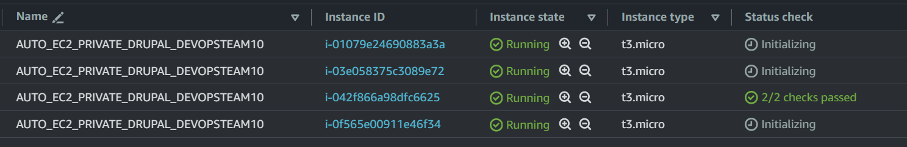
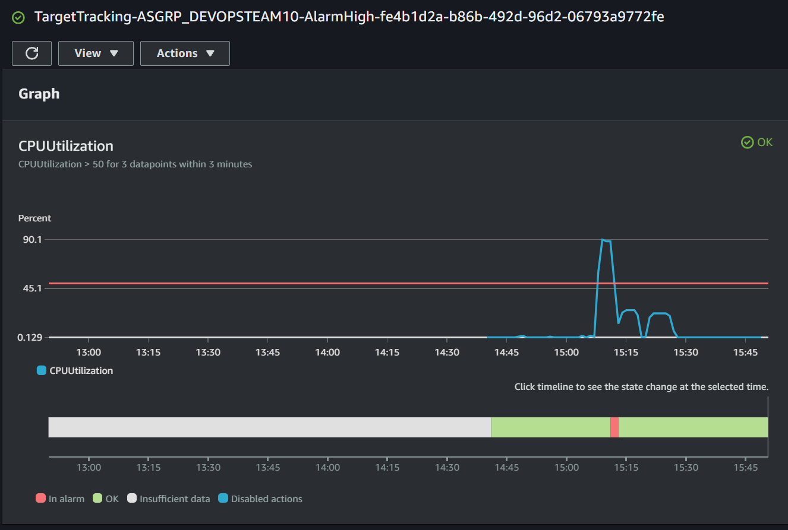
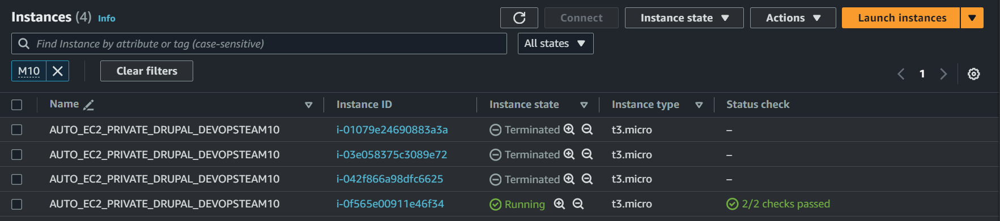
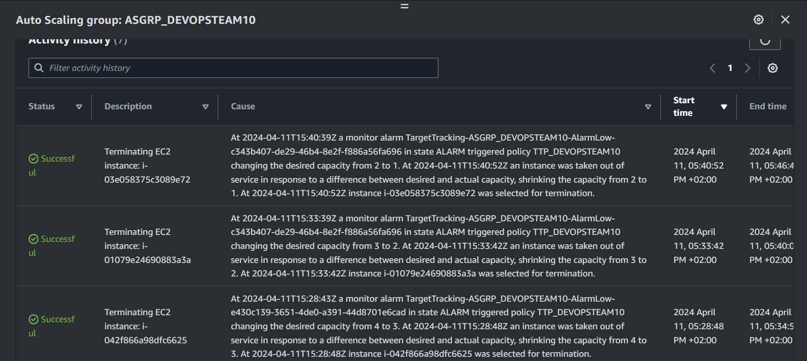

# Task 002 - Test and validate the elasticity


## Simulate heavy load to trigger a scaling action

* [Install the package "stress" on your Drupal instance](https://www.geeksforgeeks.org/linux-stress-command-with-examples/)

* [Install the package htop on your Drupal instance](https://www.geeksforgeeks.org/htop-command-in-linux-with-examples/)

* Check how many vCPU are available (with htop command)

```
[INPUT]
htop

[OUTPUT]
//copy the part representing vCPus, RAM and swap usage
    0[||                                                         1.3%]   Tasks: 31, 409 thr; 1 running
    1[                                                           0.0%]   Load average: 0.00 0.00 0.00
  Mem[||||||||||||||||||||||||||||||||||||||||||||||||||||||265M/951M]   Uptime: 00:31:55
  Swp[|                                                    1.25M/635M]

    PID USER      PRI  NI  VIRT   RES   SHR S CPU%▽MEM%   TIME+  Command
   1239 daemon     20   0  282M 40168 29428 S  0.7  4.1  0:00.52 php-fpm: pool www
   1794 bitnami    20   0  8532  4260  3408 R  0.7  0.4  0:00.18 htop
      1 root       20   0  160M 10104  7752 S  0.0  1.0  0:02.34 /sbin/init
    196 root       20   0 64788 14776 13864 S  0.0  1.5  0:00.38 /lib/systemd/systemd-journald
    214 root       20   0 19784  4452  3240 S  0.0  0.5  0:00.23 /lib/systemd/systemd-udevd
    357 root       20   0  8180  6000  1676 S  0.0  0.6  0:00.27 /usr/sbin/haveged --Foreground --verbose=1
    402 root       20   0 99884  5396  4160 S  0.0  0.6  0:00.00 /sbin/dhclient -4 -v -i -pf /run/dhclient.ens5.pid -lf /var/lib/dhcp/dhclient.ens    406 root       20   0 99884  5396  4160 S  0.0  0.6  0:00.00 /sbin/dhclient -4 -v -i -pf /run/dhclient.ens5.pid -lf /var/lib/dhcp/dhclient.ens
```

### Stress your instance

```
[INPUT]
//stress command
stress --cpu 4 --io 2 --vm 4 --vm-bytes 128M --timeout 300s

[OUTPUT]
//copy the part representing vCPus, RAM and swap usage
//tip : use two ssh sessions....
```

* (Scale-IN) Observe the autoscaling effect on your infa

=> https://eu-west-3.console.aws.amazon.com/ec2/home?region=eu-west-3#AutoScalingGroups:id=ASGRP_DEVOPSTEAM99;view=monitoring
```
[INPUT]
//Screen shot from cloud watch metric


```
[Sample](./img/CLD_AWS_CLOUDWATCH_CPU_METRICS.PNG)

=> https://eu-west-3.console.aws.amazon.com/ec2/home?region=eu-west-3#Instances:instanceState=running

```
//TODO screenshot of ec2 instances list (running state)




```
[Sample](./img/CLD_AWS_EC2_LIST.PNG)

```
//TODO Validate that the various instances have been distributed between the two available az.
[INPUT]
//aws cli command
aws ec2 describe-instances \
--query "Reservations[*].Instances[*].[InstanceId,Placement.AvailabilityZone]" \
--output table

[OUTPUT]

TODO cleanup with only DEVOPSTEAM10 instances in name

---------------------------------------
|          DescribeInstances          |
+----------------------+--------------+
|  i-058546d2eb1c5e032 |  eu-west-3a  |
|  i-085f07b949466919e |  eu-west-3a  |
|  i-02bca9e2bf33f94f9 |  eu-west-3a  |
|  i-049996ab819eadae6 |  eu-west-3a  |
|  i-04207aa2a2ba04696 |  eu-west-3a  |
|  i-01ff56ea7f1a00b14 |  eu-west-3a  |
|  i-043630f60ffad9ee6 |  eu-west-3a  |
|  i-0cf118eb71a9586af |  eu-west-3a  |
|  i-04687cd5ede2a4975 |  eu-west-3a  |
|  i-096507b5c4a77eac4 |  eu-west-3a  |
|  i-039c38d101bb81fdc |  eu-west-3a  |
|  i-008170188d9d838a0 |  eu-west-3a  |
|  i-0c5437dc716fe2336 |  eu-west-3a  |
|  i-0aedcd4dc095a36ed |  eu-west-3a  |
|  i-04411aa75690c57f8 |  eu-west-3a  |
|  i-0bf3584327875c67f |  eu-west-3a  |
|  i-01079e24690883a3a |  eu-west-3a  |
|  i-0f758efe1016f1280 |  eu-west-3a  |
|  i-00da3e6aca91129ce |  eu-west-3a  |
|  i-0397ddb6561f6904c |  eu-west-3a  |
|  i-0d83810663ad6649c |  eu-west-3a  |
|  i-01c840ced529d4ea0 |  eu-west-3a  |
|  i-0df5831a25dbbc9be |  eu-west-3a  |
|  i-0128e37bf6bfde65f |  eu-west-3a  |
|  i-0c2238e74312305d3 |  eu-west-3a  |
|  i-05c9657922807739c |  eu-west-3a  |
|  i-0d91fed030447441d |  eu-west-3a  |
|  i-08c3c1add50dddee4 |  eu-west-3a  |
|  i-0092db2e979c4abab |  eu-west-3a  |
|  i-00ee302046678280f |  eu-west-3a  |
|  i-0c77ba987ea84e912 |  eu-west-3a  |
|  i-03e058375c3089e72 |  eu-west-3a  |
|  i-03ecf7bd9de0c3661 |  eu-west-3a  |
|  i-054bfa126f5e962df |  eu-west-3a  |
|  i-05f129ab3cab57f5c |  eu-west-3a  |
|  i-0bef8585ad360f435 |  eu-west-3a  |
|  i-001a650ce2dbf4556 |  eu-west-3a  |
|  i-0086b74a4fbf9ca69 |  eu-west-3a  |
|  i-0a06b8b197445c923 |  eu-west-3a  |
|  i-0a72fe2a2aae95c03 |  eu-west-3b  |
|  i-0a860b6ae07fd7af2 |  eu-west-3b  |
|  i-00f35a130891a94be |  eu-west-3b  |
|  i-0acdbb0dc37a82a97 |  eu-west-3b  |
|  i-0389127e219635f5b |  eu-west-3b  |
|  i-0c3972d724fa3965a |  eu-west-3b  |
|  i-002eb9a614f7734c4 |  eu-west-3b  |
|  i-03e4baa4cc61d6804 |  eu-west-3b  |
|  i-0e66f11059d228bc6 |  eu-west-3b  |
|  i-0f5fcee74efe6bb2f |  eu-west-3b  |
|  i-049487f893384bffa |  eu-west-3b  |
|  i-011158dde02f357d0 |  eu-west-3b  |
|  i-076febeb2e97bfaf0 |  eu-west-3b  |
|  i-0bb0be63bb890bb75 |  eu-west-3b  |
|  i-081bc6c2717b206a7 |  eu-west-3b  |
|  i-0a70640f2ee756fd8 |  eu-west-3b  |
|  i-07f36acdcee6e9006 |  eu-west-3b  |
|  i-0c0a77418f9b7e721 |  eu-west-3b  |
|  i-0f36f7ee2b6845732 |  eu-west-3b  |
|  i-03efeaf42a2e3f59f |  eu-west-3b  |
|  i-003c65b9fff702a29 |  eu-west-3b  |
|  i-02c1bc353c0e3e677 |  eu-west-3b  |
|  i-0a95187c4d59a492e |  eu-west-3b  |
|  i-06b6c0155239de4cd |  eu-west-3b  |
|  i-04591d8d461fa6490 |  eu-west-3b  |
|  i-0b735b0981e5b8f26 |  eu-west-3b  |
|  i-0625c4839447b8ba4 |  eu-west-3b  |
|  i-0d58f756322784dc8 |  eu-west-3b  |
|  i-0cba556ac3b370a11 |  eu-west-3b  |
|  i-042f866a98dfc6625 |  eu-west-3b  |
|  i-0ff73543c47670213 |  eu-west-3b  |
|  i-0f565e00911e46f34 |  eu-west-3b  |
|  i-08a84086cff45f791 |  eu-west-3b  |
|  i-0bbc0ad4b4c47b97c |  eu-west-3b  |
|  i-094c996264a4e634b |  eu-west-3b  |
|  i-07c8907619e8b4dfd |  eu-west-3b  |
+----------------------+--------------+

```

=> See here on
Activity https://eu-west-3.console.aws.amazon.com/ec2/home?region=eu-west-3#AutoScalingGroupDetails:id=ASGRP_DEVOPSTEAM99;view=activity
```
//TODO screenshot of the activity history
```
[Sample](./img/CLD_AWS_ASG_ACTIVITY_HISTORY.PNG)

=> See here on
Alarm https://eu-west-3.console.aws.amazon.com/cloudwatch/home?region=eu-west-3#alarmsV2:alarm/TargetTracking-ASGRP_DEVOPSTEAM99-AlarmLow-5bcba447-dd39-43f8-a1ba-f887a6c985a8

https://eu-west-3.console.aws.amazon.com/cloudwatch/home?region=eu-west-3#alarmsV2:alarm/TargetTracking-ASGRP_DEVOPSTEAM10-AlarmLow-f7e55763-adcc-4a83-a2c3-f9ce39295113?~(alarmStateFilter~'ALARM~timestamp~'2024-04-11T12*3a06*3a00.000Z)
```
//TODO screenshot of the cloud watch alarm target tracking
```
[Sample](./img/CLD_AWS_CLOUDWATCH_ALARMHIGH_STATS.PNG)


* (Scale-OUT) As soon as all 4 instances have started, end stress on the main machine.

[Change the default cooldown period](https://docs.aws.amazon.com/autoscaling/ec2/userguide/ec2-auto-scaling-scaling-cooldowns.html)

```
aws autoscaling update-auto-scaling-group \
--auto-scaling-group-name ASGRP_DEVOPSTEAM10 \
--default-cooldown 100 

```
//TODO screenshot from cloud watch metric

```

```
//TODO screenshot of ec2 instances list (terminated state)

```

```
//TODO screenshot of the activity history

```

## Release Cloud resources

Once you have completed this lab release the cloud resources to avoid
unnecessary charges:

* Terminate the EC2 instances.
    * Make sure the attached EBS volumes are deleted as well.
* Delete the Auto Scaling group.
* Delete the Elastic Load Balancer.
* Delete the RDS instance.

(this last part does not need to be documented in your report.)

## Delivery

Inform your teacher of the deliverable on the repository (link to the commit to retrieve)